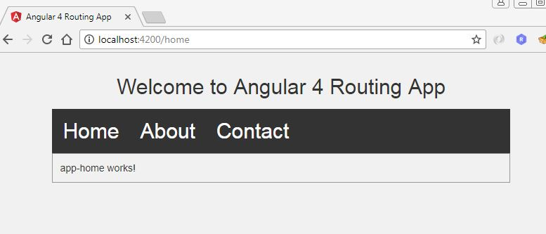
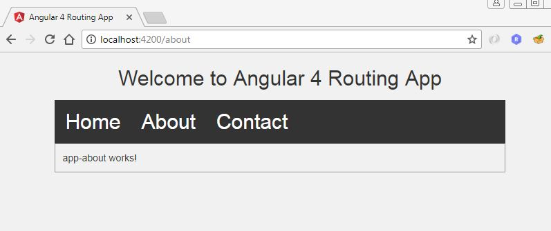
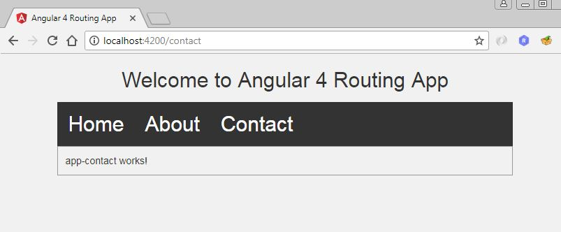

# Angular 4 Routing Example

> This is a basic http routing (url routing) example using angular 4.

### Output

## Meta

Rutvik Patel - rrpatel003@gmail.com

Distributed under the GPL V3.0 license. See ``LICENSE`` for more information.
